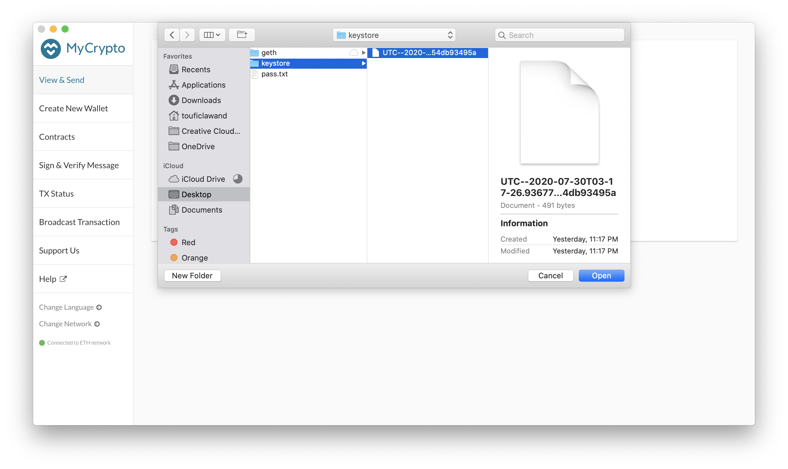
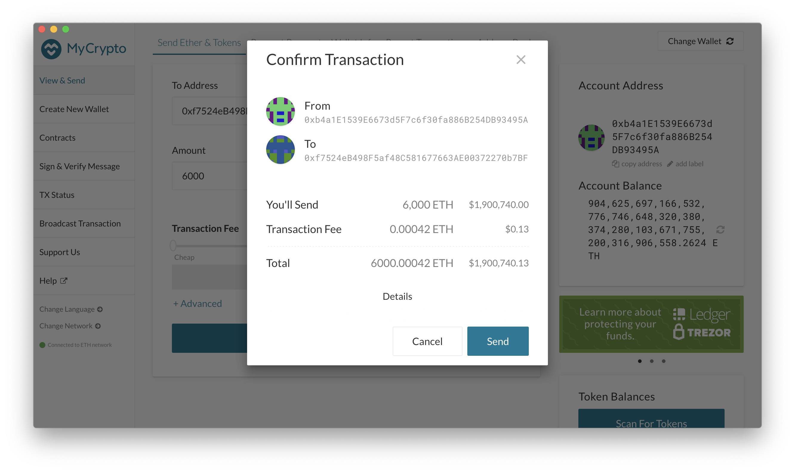

# lolnet (lolCoin)

## Dependencies
To be able to start and interact with the Ethereum blockchain test network we have created, you will need to have the following dependencies installed:

- [MyCrypto](https://www.mycrypto.com/)
	1. download the desktop application for your platform from https://download.mycrypto.com/ and follow the setup instructions from the installer.
- [Go Ethereum](https://geth.ethereum.org/)
	1. navigate to the downloads page, scroll down until you get to the **Stable releases** section, and download the latest stable release that includes the tools (the name should be similar to **Geth & Tools 1.9.18** - version number may vary).
	2. After the download is completed, extract the zipped file into a location of your choice (somewhere like your desktop or home directory as you will need to visit it often)

## How to start the network
lolnet (lolCoin), the Ethereum-based proof-of-authority blockchain network has already been setup and its files uploaded to this repo. To be able to start the network and use it, you'll need to download this repository on to your local drive and follow the below steps.

lolnet (lolCoin) is currently based off of two (2) sealer nodes - node1 and node2. You will first need to start node1, and then start node2 referring to node1 as the bootnode.

1. Navigate to the directory where you have downloaded the Go Ethereum tools
2. Start node1: run the following command `./geth --datadir <node1 path> --unlock "SEALER_ONE_ADDRESS" --mine --rpc --password <PASSWORD_FILE/ENV_VAR> --allow-insecure-unlock` where:
	- `<node1 path>` refers to the location of the node1 folder relative to your current working directory
	- `SEALER_ONE_ADDRESS` is the public address of node1 - you can find that in the node_addresses.txt file in the repo
	- `PASSWORD_FILE/ENV_VAR` refers to the pass.txt file in the node1 directory - you can also export the contents of the file as an environment variable for better security measures (**we included the password in a text file as this is a test network and the coins are worthless**)
	- the `--mine` flags enables mining on this node
	- the `--allow-insecure-unlock` allows you to unlock the node's private key using the password over http
	- the `--rpc` flag opens up a port for us to be able to communicate with the node
3. Once node1 starts, you will see something like the below start to show up in the terminal. Copy the full enode address (up to the port 30303) - you'll need that to start node2.

4. Open another terminal session
5. Start node2: run the following `./geth --datadir <node2 path> --unlock "SEALER_TWO_ADDRESS" --mine --port 30304 --bootnodes enode://SEALER_ONE_ENODE_ADDRESS@127.0.0.1:30303 --password <PASSWORD_FILE/ENV_CONSTANT> --miner.threads 1` where:
	- `<node2 path>` refers to the location of the node2 folder relative to your current working directory
	- `SEALER_TWO_ADDRESS` is the public address of node2 - you can find that in the node_addresses.txt file in the repo
	- `enode://SEALER_ONE_ENODE_ADDRESS@127.0.0.1:30303` is the node address you copied from node1 after you ran the command to start it
	- `PASSWORD_FILE/ENV_VAR` refers to the pass.txt file in the node1 directory - you can also export the contents of the file as an environment variable for better security measures (**we included the password in a text file as this is a test network and the coins are worthless**)
	- the `--mine` flags enables mining on this node
	- the `--allow-insecure-unlock` allows you to unlock the node's private key using the password over http
	- the `--rpc` flag opens up a port for us to be able to communicate with the node
	- the `--port` flag allows us to choose another port for the node (as the default port of 30303 is already being used by node1)
	- the `--miner.threads` flags allows us to choose how many cpu threads you wish the node to have access to for mining (it's included here to make sure that node2 has a thread for it to use for mining)

6. Now you have both nodes up and running (mining), good job!

### Network configuration details
lolnet (lolCoin) is configured as a proof-of-authority network based on the Ethereum blockchain. It has a block time of 15s (meaning that it takes 15s for each node to hash a block on the network), and a `chain ID = 111`.

The passwords for the nodes are included in a pass.txt file in each of the node's directories (we know this is not a safe habit, but this is purely a testnet for educational purposes, so there's no real money at risk).

As stated above, node1 has an RPC port open on the localhost for other applications to access it. The port number is 30303 by default (and we haven't changed it). node2 has a port of 30304, but you don't need to worry about it as it only uses that port to connect with node1 (you would connect to the whole network using node1's RPC port).

The public addresses for node1 and node2 are included in node_addresses.txt, and can be found below for your convenience.

- node1 address: 0xb4a1E1539E6673d5F7c6f30fa886B254DB93495A
- node2 address: 0xf7524eB498F5af48C581677663AE00372270b7BF

### Using MyCrypto with lolnet (lolCoin)
Once you have MyCrypto installed, launch the application and read through their intro. After that, you will be directed to MyCrypto's main page.

1. Click on the **Change Network** button at the bottom of the left column as shown in the screenshot.

2. Then, at the bottom of the list, click on **Add Custom Node**

3. In the pop-up window, click on **Network** and scroll all the way down until you see **Custom**. Select this option.

4. Fill out the rest of the fields per the screenshot. Make sure the Chain ID and URL match the screenshot, otherwise MyCrypto won't be able to connect to the network. Once filled out, click on save.

5. Once MyCrypto connects to the network, you will see a green dot at the bottom left corner of the main page.

6. To confirm that you are actually connected to lolnet (lolCoin), you can click on **Change Network** and see which option is selected.

7. Next, you need to load our wallet which contains the pre-funded accounts for lolnet (lolCoin). To do that, click on the **Keystore File** option on the main page. 

8. Click on **Select Wallet File** and navigate to the location of the keystore file for node1 (or node2 if you wish to connect to that instead)

9. Enter the password used to decrypt the keystore file (same password as the node1 or node2 network) and click on **Unlock**

10. Now that you've connected to the wallet, you can see the address of the wallet and its balance on the right side of the main page

11. You can now send your first crypto to the other node! To do that, enter the details as shown in the screenshot. You will need to put an address that is already on the network (as of now, there are only two addresses with funded accounts on the network - those of node1 and node2), the amount and the transaction fee.

12. Once you click on submit, MyCrypto will ask you to confirm the details again (as the transactions are irreversible). Read the details one more time, and if you're sure everything is correct, click on **Send**.

13. Once the transaction is posted to the network, a confirmation pops up at the bottom of MyCrypto's screen showing you the transaction hash.

14. To see more details (and the status of the transaction), you can navigate to the recent transactions tab and clicking on the latest transaction in the list. This page will show you the details of the transaction including block number, gas price, gas limit, and gas used. **Also, notice how the balance changed by the amount of ETH we sent to the other account**

We hope you find this guide helpful, and please feel free to reach out with any questions, comments, or suggestions you might have.